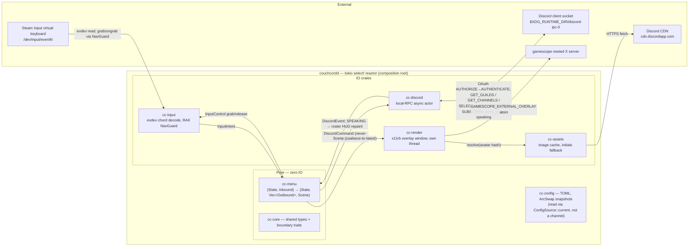

# couchcord

Controller-driven Discord **voice control + activity overlay** for a gamescope
Big Picture / game-mode session — browse and join voice channels, leave, and see
who's talking, from the couch, while a game runs, **without Discord ever being a
focus-stealing window**.

- **What & why:** [`SPEC.md`](SPEC.md)
- **Architecture (canonical):** [`docs/ARCHITECTURE.md`](docs/ARCHITECTURE.md) —
  synthesized by an adversarial design panel; proposals/critiques in
  [`docs/panel/`](docs/panel).

The topology (per `ARCHITECTURE.md` §4): one binary, a `tokio::select!` reactor
as composition root; every edge is a bounded per-producer→consumer `tokio::mpsc`
with a named overflow policy — not a broadcast bus.



## Status

| Phase | What | State |
|---|---|---|
| 0 | `couchcordd doctor` de-risk gate | ✅ gamescope external-overlay atom **verified** |
| 1 | Pure core + all crate logic | ✅ unit-tested |
| 2 | `cc-discord` RPC client (async actor) | ✅ code + **mock-socket test** |
| 3 | `cc-input` evdev `InputSource` (grab + read) | ✅ code; live validation pending controller+game |
| 4 | `cc-render` X11 overlay window + `cc-assets` CDN fetch | ✅ code; live validation pending session |
| 5 | `couchcordd run` composes everything | ✅ **compiles + wired**; reactor mock-tested |

**58 tests, whole workspace compiles, `couchcordd run` is fully composed.**
Everything that is automatable is done. What remains is **live validation** — it
needs you at the desk: Discord running (Phase 2 auth round-trip), and the
controller + a game session (Phase 3/4 input + overlay). See
[`docs/SETUP.md`](docs/SETUP.md).

## Crates (cargo workspace, compile-isolated)

Domain crates may depend **only** on `cc-core`, never on each other — the
modularity is mechanical, not aspirational.

| Crate | Responsibility | Phase 1 (tested) | Deferred IO |
|---|---|---|---|
| `cc-core` | shared types, domain enums, boundary traits, `Scene` | types/traits | — |
| `cc-config` | TOML load/validate + `ArcSwap` ConfigSource | parse, defaults, snapshot | — |
| `cc-discord` | local-RPC framing, parsing, **voice filter** | protocol + filter | socket + OAuth (P2) |
| `cc-menu` | the pure app state machine | **full flow** | — |
| `cc-render` | gamescope external-overlay | **8-anchor geometry** | X11 window (P4) |
| `cc-assets` | Discord CDN hash → image | URL + cache | HTTP fetch (P4) |
| `cc-input` | Steam virtual-kbd → intents | classify + keymap | evdev grab (P3) |
| `couchcordd` | daemon: `doctor` now, composition root later | doctor | reactor (P5) |

## Install

> **Caveat:** Discord live-validation is still pending (Phase 2 auth
> round-trip) and the config schema may still change — treat 0.1.x as a
> preview package.

**Arch** — from the [mason](https://github.com/MasonRhodesDev/arch-repo)
pacman repo. Add to `/etc/pacman.conf`:

```ini
[mason]
# Import the signing key first: https://github.com/MasonRhodesDev/arch-repo#use-it
SigLevel = Required DatabaseRequired
Server = https://masonrhodesdev.github.io/arch-repo/x86_64
```

```sh
sudo pacman -Syu couchcord
```

**Fedora** — from COPR:

```sh
sudo dnf copr enable solaris765/couchcord
sudo dnf install couchcord
```

Then follow the one-time steps in [`docs/SETUP.md`](docs/SETUP.md) (`input`
group, config, Steam Input layer, `systemctl --user enable --now couchcordd`).

## Build & test (development)

```sh
cargo test --workspace      # 58 tests, no hardware needed
cargo run -p couchcordd -- doctor   # re-run inside a game-mode session to verify P2/P3 assumptions
```
